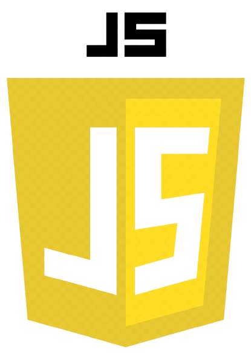

## À propos du projet

Ce projet justifie les comptétence de Git de l'auteur et implique les notions principales :

- Commits signés par la clé GPG
- Créer des issues et issues templates
- Créer des pull request et pull request template
- Comprendre la syntaxe Markdown pour rédiger les fichiers Readme, Contributing, Issue Template et Pull Request Template
- Le fichier .gitignore
- Respecter le Gitflow
- Utiliser le hooks pour automatiser des tâches liées à un dépôt de code
- Synchronisation nôtre dépôt sur Gitlab

### Les applications

- Trois petites apps qui utilisent HTML,CSS,JAVASCRIPT

  
 
 

1. Digital Clock
2. New Year Countdown
3. Random Colors Generator
